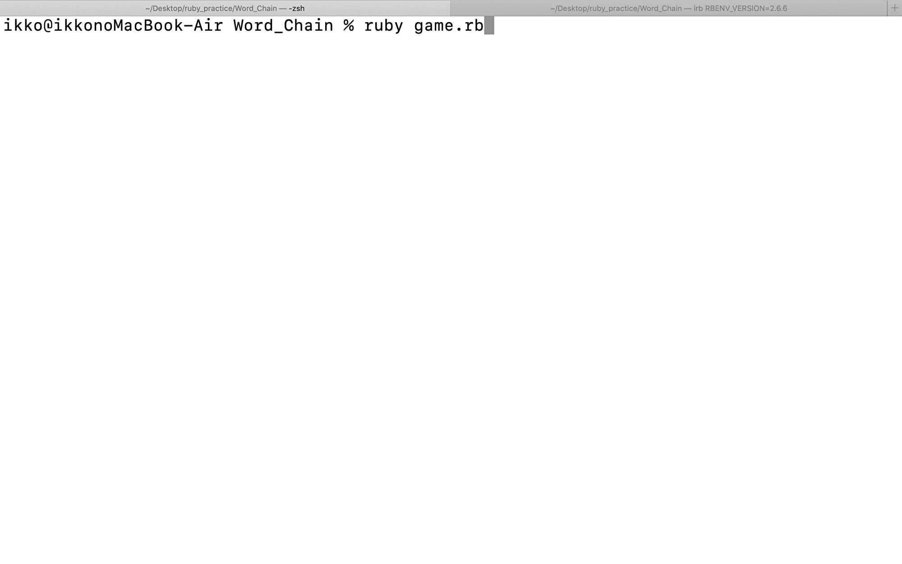

## Product Name
---
Ruby対話型国名しりとりゲーム

## Description
---
このゲームの対象は4才以上です。

しりとり名人シーサと国名しりとり対決します。

ルールは、

ひらがな又はカタカナ入力です。

語尾が「ン」で終った場合、

同じ国名を二度繰り返した場合、

または制限時間20秒を過ぎたら負けです。

このしりとりゲームを通して、今まで聞いたことのない国名に出会いそして興味を持ち行ってみたいと思えたら嬉しいです。

## Demo
---


## Usage
---
クローンします。
```
$ git clone https://github.com/Ikko-T/Word_Chain.git
```
`Word_Chain`ディレクトリへ移動します。
```
$ cd Word_Chain
```
下記コマンド実行でゲームが開始します。
```
$ ruby game.rb
```

## Installation
---
`pry`を導入します。

`$ gem install pry`

## Author
---
[Ikko Tsuha](https://github.com/Ikko-T)

- Twitter: [@ikko1021](https://twitter.com/ikko1021)

- GitHub: [@Ikko-T](https://github.com/Ikko-T)

- Qiita: <a href="https://qiita.com/Ikko-T" rel="nofollow">@Ikko-T</a>

## Licence
---

(C)Copyright 2020 Ikko Tsuha
